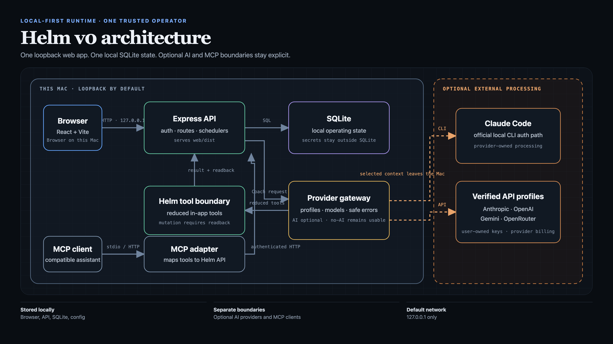

# Helm Personal OS

[](https://github.com/joelpfrank/helm-personal-os/actions/workflows/ci.yml)
[](https://github.com/joelpfrank/helm-personal-os/actions/workflows/codeql.yml)

Helm is a local-first personal operating system for connecting long-term direction to everyday action. It brings goals, kanban tasks, habits, food, workouts, check-ins, and an evidence-grounded AI coach into one self-hosted web app. Many of the same records are available through Model Context Protocol (MCP) tools, so a compatible assistant can read and update the system with explicit tool calls.

> **Project stage:** early, macOS-first, and designed for one operator. Helm is not a hosted service, team workspace, medical device, or substitute for professional advice.

## What is included

- **Goals and coaching:** vision, nested goals, success criteria, obstacles, goal links, coaching preferences, and morning/midday/evening/weekly review records.
- **Planning:** boards, columns, cards, tags, due dates, and a unified today view.
- **Habits and health logs:** scheduled habits with explicit achieved/not-achieved outcomes, meals and macro estimates, body weight, activities, workout routines, sets, rest timers, history, and progression suggestions.
- **Calendar:** Google Calendar sync and event storage are retained end-to-end and reachable through the API and MCP tools; it is not surfaced in the simplified web navigation (no Calendar tab today — see [Known limitations](docs/KNOWN-LIMITATIONS.md)).
- **Extensibility:** retained custom-module and saved-agent APIs, web/CLI chat surfaces, and stdio or loopback HTTP MCP transports. The simplified web navigation currently focuses on Tasks, Food, Habits, Workouts, and Coach rather than exposing every retained subsystem.
- **Local persistence:** SQLite data on the operator's machine, with bearer-token API authentication and a first-run password for the browser UI.
- **Appearance:** two independent controls in the sidebar — a color theme (Neutral or Rose) and light/dark/system. All four combinations are contrast-checked against WCAG AA. Both choices are stored in the browser, so each browser profile on the machine keeps its own look.

The non-AI records and workflows do not require an AI account. AI-backed requests are not local-only: they send selected prompt context to the configured provider. See [Privacy](PRIVACY.md).

## Screenshots and architecture

All screens below show the fictional "Port Aurora" workspace produced by [`scripts/create-demo-workspace.mjs`](scripts/create-demo-workspace.mjs) — synthetic demo data only, never a real operator's records.

| | |
| --- | --- |
|  |  |
| Today — the daily command meeting, closeout, and vision review, plus active goals, today's habits, and recent reflections. | Coach — the vision layer: north star, identity statement, and values that anchor the coach's context. |
|  |  |
| Tasks — simple kanban boards for work and life. | Habits and Workouts — a clearly labelled two-panel composite of two real screens: scheduled habits with logged quantities and completed workout history. |



The architecture visual separates what stays on the Mac from optional external
AI processing, including the in-app provider gateway and MCP client path. Open
the [standalone architecture diagram](docs/helm-architecture.html).

Regenerate every asset — screenshots, architecture, and the carousel and demo
video that this repository deliberately does not ship — with `npm run demo:assets`
(see [Reproducing the demo assets](docs/DEVELOPMENT.md#reproducing-the-demo-assets)).

## Five-minute Mac setup

Requirements: macOS and Node.js 20 or newer. From the folder containing the
downloaded archive and checksum:

```sh
shasum -a 256 -c Helm-portable-v0.zip.sha256
unzip Helm-portable-v0.zip
cd Helm
./install-helm.sh --dry-run
./install-helm.sh --state-dir "$HOME/Library/Application Support/Helm"
```

The installer builds in private temporary storage, installs a per-user
loopback-only service, verifies `/api/health`, and prints the local first-run
address. Create the first local password in the browser. No AI account is
required. The external state directory keeps the database and credentials
outside replaceable application code; read [Install Helm on your Mac](INSTALL.md)
before an upgrade or backup.

## Quick start for development

Requirements: macOS, Node.js 20+, npm, and Git.

```sh
npm ci
npm run build
npm start
```

Open `http://127.0.0.1:8787` and create the first local password. The server binds to `127.0.0.1` by default. Application data is created under `server/data/`; local credentials are created outside the database and are excluded from source control.

For separate watch processes during development:

```sh
npm run dev:server
npm run dev:web
```

The Vite development server proxies API requests to `http://127.0.0.1:8787` by default.

## macOS installation

The portable installer stages dependencies and the frontend before replacing an installation, can register a per-user LaunchAgent, and refuses to overwrite an existing installation unless `--upgrade` is supplied.

```sh
./install-helm.sh --dry-run
./install-helm.sh
```

The default destination is `~/Helm`, and the default service URL is `http://127.0.0.1:8787`. Read [Install Helm on your Mac](INSTALL.md) before using an archive or upgrade. To connect an assistant after installation, use the [Agent integrations](AGENT-INTEGRATIONS.md) guide.

## Choose your AI

AI is optional. Choose in **Coach → AI setup**; readiness checks do not send a
prompt or consume inference. An external MCP host is a separate integration
boundary: it can use Helm's structured tools, but its configured model may
process tool arguments and returned records remotely.

Helm's default in-app AI profile uses the Claude Agent SDK with credentials from a local Claude Code login (`claude` on the machine running Helm; run `claude auth login`). This can use an eligible Claude subscription; it is not the same as making requests with an Anthropic API key. Helm disables the SDK's local file and shell tools for in-app chat and supplies Helm operations through an in-process MCP server.

Choose and persist another profile in AI setup. Environment-based
`HELM_PROVIDER_PROFILE` and the legacy `LLM_BACKEND=api` selector remain
compatibility overrides for operator-managed deployments.

| Choice | Required credential | Billing and processing boundary |
| --- | --- | --- |
| No AI | None | Core records stay available; Coach message generation is disabled. |
| `anthropic:claude-code` (default) | Local `claude auth login` | Eligible Claude Code/Claude subscription allowance; provider-owned CLI lifecycle. |
| `openai:codex-cli` | Local `codex login` | Eligible ChatGPT/Codex plan allowance; provider-owned CLI lifecycle. Not OpenAI API billing. |
| Anthropic API (`anthropic:api`) | `ANTHROPIC_API_KEY` | Anthropic API account and API billing. |
| `openai:api` | `OPENAI_API_KEY` | OpenAI API billing is separate from ChatGPT subscriptions. |
| Gemini API (`google:gemini-api`) | `GEMINI_API_KEY` | Gemini API access and billing are separate from Gemini consumer and CLI allowances. |
| `openrouter:api` | `OPENROUTER_API_KEY` | Requests consume OpenRouter credits, including when an upstream model is selected. |
| External MCP host | Host-specific | The host receives selected tool data and uses its own model/provider terms. |

API credentials are server-only. Do not place them in SQLite, browser storage, URLs, LaunchAgent arguments, source files, or chat. The status endpoint checks only whether the selected credential is present; it never returns a value, suffix, or fingerprint and does not make an inference request.

Two profiles run on a subscription instead of an API key, and both work the same way: Helm shells out to the provider's own first-party CLI, which owns its sign-in. Helm never reads, copies, or reimplements those credentials, and it never sends a subscription credential to a provider HTTP API itself — a third-party HTTP call made with CLI credentials is not an authorized use of the plan, so the CLI has to be the one making the request.

- **Claude Code** (`anthropic:claude-code`): `claude auth login`, driven through the Claude Agent SDK.
- **Codex CLI** (`openai:codex-cli`): `codex login`, driven through `codex exec`. Helm passes the conversation on stdin (never on the command line), runs the agent with a read-only sandbox so its shell and file tools cannot write to the machine, and passes `--ephemeral` so the provider CLI persists no session transcript. Helm operations reach the model through the same MCP tool surface every other MCP client uses: Codex spawns Helm's stdio MCP server, which resolves the dashboard token from the state directory itself, so no secret ever appears in the process table. Attachments are not supported on this profile — an image or document attachment fails with a clear capability error rather than being silently dropped. Set `HELM_CODEX_BIN` if `codex` lives outside the server's `PATH`.

The Codex profile is the ChatGPT/Codex *plan* path; it is not, and does not stand in for, an OpenAI API key (`openai:api`), which bills separately. Gemini CLI login is not supported as a Helm Coach profile: its consumer/CLI allowance is not a reusable Gemini API credential, and Helm does not inspect or copy that CLI's credential files or simulate the unsupported route.

**Selecting a profile is not the same as it being configured.** Helm verifies subscription profiles with a bounded, inference-free CLI status check (`claude auth status`, `codex login status`) and checks API-key presence locally. Both checks fail closed: output Helm does not positively recognize as signed in is reported as unconfigured, never assumed to work. AI setup shows, per profile, whether that provider is actually available on this machine. `GET /api/chat/status` and the Coach banner report the selected provider/profile, model catalog, capabilities, and either ready or a provider-specific setup reason. No inference call is made just to check status. Core Helm surfaces (Tasks, Food, Habits, Workouts, non-AI chat CRUD) stay usable when AI is unconfigured, as does the API/MCP-only Calendar sync; only sending a message to Coach requires a ready profile.

If the provider itself fails mid-conversation (expired auth, an unavailable model, rate limiting, or any other provider error), Helm maps the failure to one of a small fixed set of safe, actionable messages sent to the browser. Raw provider response bodies, stack traces, and API keys are never sent to the client, stored in chat history, or written to the server log — arbitrary secrets can't be reliably scrubbed after the fact, so the server logs only a closed set of non-sensitive fields (an error category and, when available, the HTTP status) rather than the raw text. If a conversation's model is no longer available on the active backend (e.g. after switching backends, or an old stored model id), Helm falls back to a documented default model for that turn instead of failing silently.

## Documentation

- [Architecture](docs/ARCHITECTURE.md)
- [Technical case study](docs/CASE-STUDY.md)
- [Coaching design](docs/COACHING.md)
- [Development guide](docs/DEVELOPMENT.md)
- [Agent integrations](AGENT-INTEGRATIONS.md)
- [MCP integration](docs/MCP.md)
- [Known limitations](docs/KNOWN-LIMITATIONS.md)
- [Roadmap](docs/ROADMAP.md)
- [Maintainers](docs/MAINTAINERS.md)
- [Privacy](PRIVACY.md)
- [Security policy](SECURITY.md)
- [Contributing](CONTRIBUTING.md)
- [Third-party licenses](THIRD_PARTY_LICENSES.md)

## Verification

```sh
npm run check
npm run package:portable
```

`npm run check` runs the Node test suite, production frontend build, public metadata and privacy checks, forbidden-path scan, reproducible portable-package build and inspection, an independent secret scan, and the production dependency audit. It writes the verified blank-data `dist/Helm-portable-v0.zip` and checksum; it does not package an operator's database or credentials.

The same command works from an unpacked `Helm-portable-v0.zip`, which has no Git tree: the privacy and secret scans read your files from disk instead of the Git index, and the steps that can only read a Git index — the history scans and the portable rebuild — say so and are skipped rather than failing.

## Known limits

- macOS is the supported installation target today; other operating systems are not claimed to work.
- The current security and data model assumes a single trusted operator on a trusted host.
- Loopback binding reduces accidental network exposure but does not protect against another process or user with sufficient host access.
- SQLite files, local logs, exports, and backups are not application-level encrypted by Helm.
- Optional calendar, AI, MCP, notification, and messaging integrations create additional provider and credential boundaries.

## License

Helm-authored source is available under the [MIT License](LICENSE). Dependencies retain their own licenses. The Anthropic Claude Agent SDK is separately licensed proprietary software and is not covered by Helm's MIT license; see [Third-party licenses](THIRD_PARTY_LICENSES.md).
