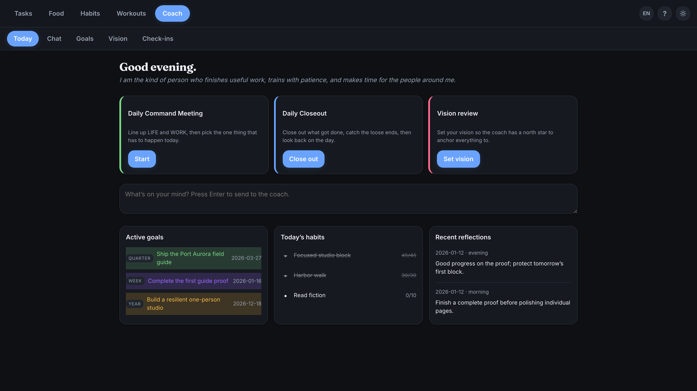
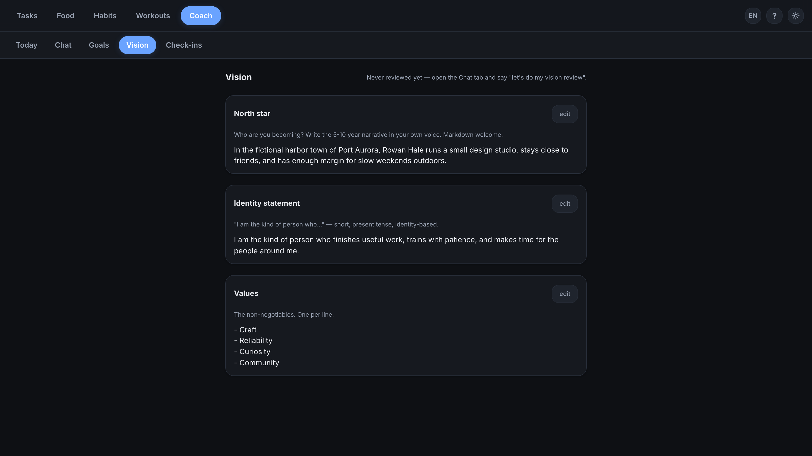
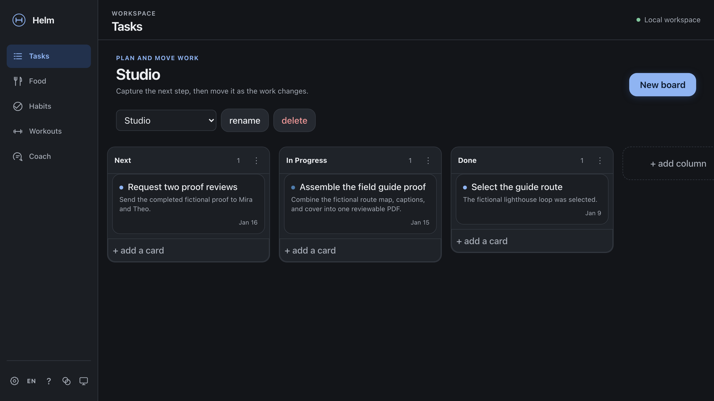
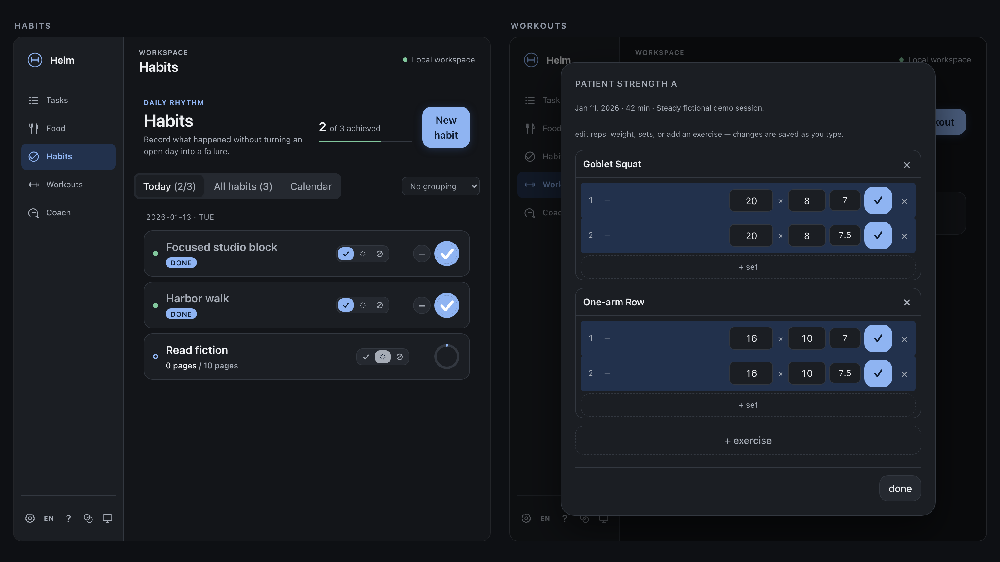

# Helm Personal OS

Helm is a local-first personal operating system for connecting long-term direction to everyday action. It brings goals, kanban tasks, habits, food, workouts, check-ins, and an evidence-grounded AI coach into one self-hosted web app. Many of the same records are available through Model Context Protocol (MCP) tools, so a compatible assistant can read and update the system with explicit tool calls.

> **Project stage:** early, macOS-first, and designed for one operator. Helm is not a hosted service, team workspace, medical device, or substitute for professional advice.

## What is included

- **Goals and coaching:** vision, nested goals, success criteria, obstacles, goal links, coaching preferences, and morning/midday/evening/weekly review records.
- **Planning:** boards, columns, cards, tags, due dates, and a unified today view.
- **Habits and health logs:** scheduled habits with explicit achieved/not-achieved outcomes, meals and macro estimates, body weight, activities, workout routines, sets, rest timers, history, and progression suggestions.
- **Calendar:** Google Calendar sync and event storage are retained end-to-end and reachable through the API and MCP tools; it is not surfaced in the simplified web navigation (no Calendar tab today — see [Known limitations](docs/KNOWN-LIMITATIONS.md)).
- **Extensibility:** retained custom-module and saved-agent APIs, web/CLI chat surfaces, and stdio or loopback HTTP MCP transports. The simplified web navigation currently focuses on Tasks, Food, Habits, Workouts, and Coach rather than exposing every retained subsystem.
- **Local persistence:** SQLite data on the operator's machine, with bearer-token API authentication and a first-run password for the browser UI.

The non-AI records and workflows do not require an AI account. AI-backed requests are not local-only: they send selected prompt context to the configured provider. See [Privacy](PRIVACY.md).

## Screenshots and demo

All screens below show the fictional "Port Aurora" workspace produced by [`scripts/create-demo-workspace.mjs`](scripts/create-demo-workspace.mjs) — synthetic demo data only, never a real operator's records.

| | |
| --- | --- |
|  |  |
| Today — the daily command meeting, closeout, and vision review, plus active goals, today's habits, and recent reflections. | Coach — the vision layer: north star, identity statement, and values that anchor the coach's context. |
|  |  |
| Tasks — simple kanban boards for work and life. | Habits and Workouts — a clearly labelled two-panel composite of two real screens: scheduled habits with logged quantities and completed workout history. |

**Demo video:** [`docs/assets/helm-demo.mp4`](docs/assets/helm-demo.mp4) (85 seconds, 1280x720, H.264, captioned, deliberately silent — GitHub's Markdown viewer does not play back repository-hosted video, so this is a direct link rather than an embed). It walks through vision and goals, the daily command meeting and if/then obstacle plans, typing a message to the coach (not sent — no AI provider is called in the demo), logging habits/workouts/food, and an evidence-backed weekly review, all against the same synthetic workspace.

Regenerate both with `npm run demo:assets` (see [Reproducing the demo assets](docs/DEVELOPMENT.md#reproducing-the-demo-assets)).

## Quick start for development

Requirements: macOS, Node.js 20+, npm, and Git.

```sh
npm ci
npm run build
npm start
```

Open `http://127.0.0.1:8787` and create the first local password. The server binds to `127.0.0.1` by default. Application data is created under `server/data/`; local credentials are created outside the database and are excluded from source control.

For separate watch processes during development:

```sh
npm run dev:server
npm run dev:web
```

The Vite development server proxies API requests to `http://127.0.0.1:8787` by default.

## macOS installation

The portable installer stages dependencies and the frontend before replacing an installation, can register a per-user LaunchAgent, and refuses to overwrite an existing installation unless `--upgrade` is supplied.

```sh
./install-helm.sh --dry-run
./install-helm.sh
```

The default destination is `~/Helm`, and the default service URL is `http://127.0.0.1:8787`. Read [HERMES-INSTALL.md](HERMES-INSTALL.md) before using an archive or upgrade.

## AI backends: Claude Code versus API

Helm's default in-app AI backend (`sdk`) uses the Claude Agent SDK with credentials from a local Claude Code login (`claude` on the machine running Helm; run `claude auth login`). This can use an eligible Claude subscription; it is not the same as making requests with an Anthropic API key. Helm disables the SDK's local file and shell tools for in-app chat and supplies Helm operations through an in-process MCP server.

Set `LLM_BACKEND=api` to select the alternative Anthropic Messages API path. That path requires `ANTHROPIC_API_KEY` and may incur API charges under the operator's Anthropic account. An API key is also used for optional short API-only operations such as automatic conversation titles. In either mode, request content is processed outside the host by Anthropic.

**Selecting a backend is not the same as it being configured.** Helm does not assume the `sdk` backend works just because it's the default — the server verifies local Claude Code auth with a bounded `claude auth status` check (a few seconds max) and caches the result briefly (`HELM_AUTH_STATUS_TTL_MS`, default 30s) so it isn't re-run on every request. No inference call is ever made just to check status, on either backend. `GET /api/chat/status` and the Coach chat banner report one of: ready, or unconfigured with a specific, actionable reason — CLI not installed, not signed in, sign-in expired, status check timed out, or (API backend) no `ANTHROPIC_API_KEY` set. Core Helm surfaces (Tasks, Food, Habits, Workouts, non-AI chat CRUD) stay usable in every one of these states, as does the API/MCP-only Calendar sync (not surfaced in the simplified web navigation); only sending a message to the coach requires the backend to be configured.

If the provider itself fails mid-conversation (expired auth, an unavailable model, rate limiting, or any other provider error), Helm maps the failure to one of a small fixed set of safe, actionable messages sent to the browser. Raw provider response bodies, stack traces, and API keys are never sent to the client, stored in chat history, or written to the server log — arbitrary secrets can't be reliably scrubbed after the fact, so the server logs only a closed set of non-sensitive fields (an error category and, when available, the HTTP status) rather than the raw text. If a conversation's model is no longer available on the active backend (e.g. after switching backends, or an old stored model id), Helm falls back to a documented default model for that turn instead of failing silently.

## Documentation

- [Architecture](docs/ARCHITECTURE.md)
- [Technical case study](docs/CASE-STUDY.md)
- [Coaching design](docs/COACHING.md)
- [Development guide](docs/DEVELOPMENT.md)
- [MCP integration](docs/MCP.md)
- [Known limitations](docs/KNOWN-LIMITATIONS.md)
- [Roadmap](docs/ROADMAP.md)
- [Maintainers](docs/MAINTAINERS.md)
- [Privacy](PRIVACY.md)
- [Security policy](SECURITY.md)
- [Contributing](CONTRIBUTING.md)
- [Third-party licenses](THIRD_PARTY_LICENSES.md)

## Verification

```sh
npm run check
npm run package:portable
```

`npm run check` runs the Node test suite, production frontend build, public metadata and privacy checks, forbidden-path scan, reproducible portable-package build and inspection, an independent secret scan, and the production dependency audit. It writes the verified blank-data archive and checksum under `dist/`; it does not package an operator's database or credentials.

## Known limits

- macOS is the supported installation target today; other operating systems are not claimed to work.
- The current security and data model assumes a single trusted operator on a trusted host.
- Loopback binding reduces accidental network exposure but does not protect against another process or user with sufficient host access.
- SQLite files, local logs, exports, and backups are not application-level encrypted by Helm.
- Optional calendar, AI, MCP, notification, and messaging integrations create additional provider and credential boundaries.

## License

Helm-authored source is available under the [MIT License](LICENSE). Dependencies retain their own licenses. The Anthropic Claude Agent SDK is separately licensed proprietary software and is not covered by Helm's MIT license; see [Third-party licenses](THIRD_PARTY_LICENSES.md).
